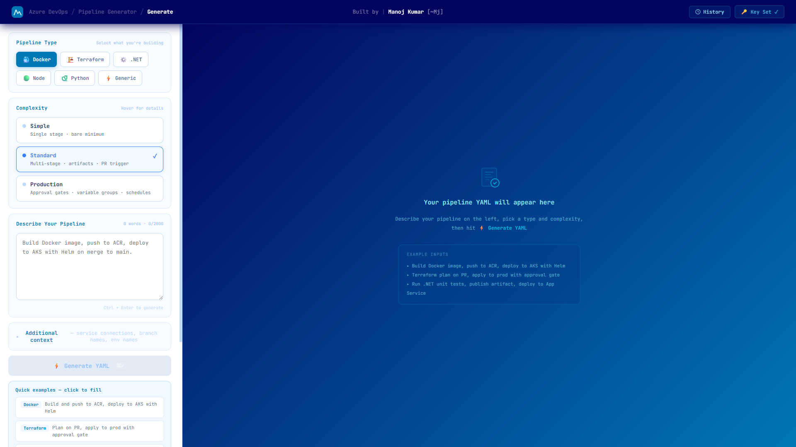

# Azure Pipeline YAML Generator
> Generate production-ready `azure-pipelines.yml` files from plain English — in seconds.

**Live:** [azure-pipeline-yaml-generator.vercel.app](https://azure-pipeline-yaml-generator.vercel.app)

&nbsp;



---

## What it does

Describe your pipeline in plain English. Pick a type and complexity. Get a validated, schema-correct `azure-pipelines.yml` ready to drop into your repo.

No more digging through ADO docs. No more YAML syntax errors. No more copy-pasting from Stack Overflow.

---

## Why I built this

Writing Azure DevOps pipelines from scratch is painful — especially for teams that don't live in YAML every day. I've seen engineers spend hours getting the schema right for something that should take minutes.

This tool handles the schema, the task names, the stage structure, the artifact passing, the approval gates — so you can focus on what the pipeline actually needs to do.

---

## Pipeline types supported

| Type | What it covers |
|------|---------------|
| **Docker** | ACR push, AKS + Helm, Container Apps, multi-region, slot swap |
| **Terraform** | Multi-subscription, hub-spoke, blob backend, approval gates |
| **.NET** | Coverage gates, staging slot, swap to production |
| **Node** | Jest, Playwright, Monorepo, Lighthouse, Static Web Apps |
| **Python** | FastAPI/Django, flake8, DB migration, AKS deploy |
| **Generic** | Trivy scan, Databricks, Great Expectations, Helm rollback |

---

## Complexity tiers

- **Simple** — Single stage, trigger on main, bare minimum steps
- **Standard** — Multi-stage, artifact passing, PR trigger, conditions
- **Production** — Approval gates, variable groups, environments, schedules, health checks

---

## How it works

1. Describe your pipeline in plain English
2. Select pipeline type + complexity
3. Enter your free [Groq API key](https://console.groq.com/keys) — stored in your browser only, never sent to any server
4. Hit Generate — get a complete `azure-pipelines.yml`
5. Copy or download directly

---

## Stack

- **Frontend** — React + Vite, deployed on Vercel
- **Backend** — FastAPI + Python, deployed on Render (Docker)
- **AI** — Groq `llama-3.3-70b-versatile` via BYOK
- **Storage** — localStorage only (keys, history, preferences)

---

## Key engineering decisions

- **Split prompt routing** — 6 separate system prompts per pipeline type (~1,400 tokens/request vs 6,000+ monolithic). Solves Groq free tier token limits.
- **Retry logic** — auto-retries if output is missing the `stages:` wrapper, catching GitLab/GitHub Actions syntax leakage from the model.
- **50+ ADO schema rules** — task whitelist, correct/wrong examples, stage isolation rules, per-type enforcement.
- **BYOK** — your API key never leaves your browser.

---

## Running locally

**Backend**
```bash
cd backend
pip install -r requirements.txt
uvicorn main:app --reload --port 8000
```

**Frontend**
```bash
cd frontend
npm install
npm run dev
```

Frontend → `http://localhost:5173` | Backend → `http://localhost:8000`

---

## Part of a DevOps tools portfolio

| Project | Description | Live |
|---------|-------------|------|
| AI DevOps Incident Copilot | Paste failed log → root cause + fix | [Live](https://ai-dev-ops-incident-copilot.vercel.app) |
| Azure Pipeline YAML Generator | Plain English → azure-pipelines.yml | [Live](https://azure-pipeline-yaml-generator.vercel.app) |
| Kubernetes YAML Validator | Paste K8s YAML → errors, warnings + fixed version | [Live](https://kubernetes-yaml-validator.vercel.app) |
| DevOps Interview Copilot | Practice DevOps interview Q&A with AI | [Live](https://devops-interview-copilot.vercel.app) |

---

Built by [Manoj Kumar](https://linkedin.com/in/manoj2606) — Senior DevOps Engineer