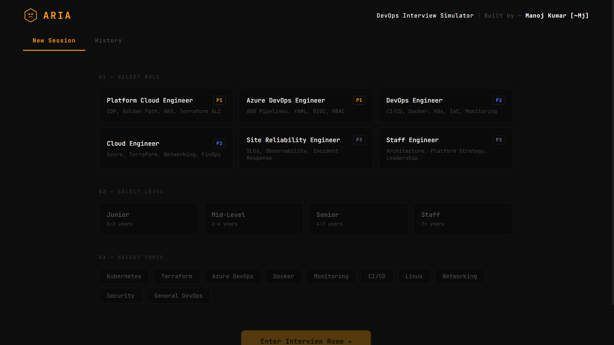

# DevOps Interview Copilot — ARIA
> Pick a role. Answer 10 questions. Get scored, evaluated, and told exactly what to study next.

**Live:** [devops-interview-copilot.vercel.app](https://devops-interview-copilot.vercel.app)

&nbsp;



---

## What it does

Pick your target role, experience level, and topic — ARIA (Automated Review & Interview Agent) conducts a live 10-question interview session, evaluates every answer with a score, breaks down what you got right and what you missed, gives you the model answer, and delivers a final report with a hire recommendation and a study plan.

No generic question banks. No multiple choice. A real interview simulation that tells you exactly where you stand.

---

## Why I built this

I interview for DevOps and Cloud roles in Europe. The gap between knowing a tool and being able to explain it under pressure is real. Most practice tools either give you flashcards or throw random questions with no feedback. This gives you a scored evaluation after every answer — the same way a real interviewer would.

Built to practice. Built to improve. Built because "I know Kubernetes" and "I can explain Kubernetes to a Senior hiring manager" are two different things.

---

## Roles covered

| Role | Focus areas |
|------|-------------|
| **Platform Cloud Engineer** | IDP, Golden Path, AKS, Terraform ALZ, Workload Identity |
| **Azure DevOps Engineer** | ADO Pipelines, YAML, OIDC, RBAC, Service Connections |
| **DevOps Engineer** | CI/CD, Docker, Kubernetes, IaC, Monitoring |
| **Cloud Engineer** | Azure, Terraform, Networking, FinOps, Governance |
| **Site Reliability Engineer** | SLOs, Error Budgets, Observability, Incident Response |
| **Staff Engineer** | Architecture, Platform Strategy, Technical Leadership |

---

## Scoring — no mercy

Every answer is evaluated strictly against the role and level. No inflation.

| Score | Verdict | What it means |
|-------|---------|---------------|
| **9–10** | Excellent | Near-perfect. Covers all concepts, tools, trade-offs, edge cases. Hard to earn. |
| **7–8** | Strong | Solid. Covers most core concepts, minor gaps only. |
| **5–6** | Adequate | Gets the main idea. Missing important details or best practices. |
| **3–4** | Weak | Partial understanding. Significant gaps. Would not pass a real interview. |
| **0–2** | Poor | Fundamentally wrong or too vague to demonstrate knowledge. |

---

## How it works

1. Pick your **Role**, **Level**, and **Topic**
2. Enter your free [Groq API key](https://console.groq.com/keys) — stored in your browser only
3. ARIA asks 10 questions one by one — each typed out in real time
4. Submit your answer — ARIA evaluates it instantly
5. Session ends → full report: overall score, hire recommendation, strong areas, weak areas, study plan

---

## Stack

- **Frontend** — React + Vite, deployed on Vercel
- **Backend** — FastAPI + Python, deployed on Render (Docker)
- **AI** — Groq `moonshotai/kimi-k2-instruct` via BYOK
- **Storage** — localStorage only (key, session history)

---

## Key engineering decisions

- **BYOK** — Your Groq key is stored in localStorage only. Never sent to any server other than Groq directly.
- **Strict scoring** — Prompts are engineered to resist grade inflation. Vague bullet answers are capped at 6. No-specifics answers are capped at 4.
- **Session persistence** — If you reload mid-session, the interview restores exactly where you left off — question, exchanges, and the answer you were typing.
- **History with topic filter** — Every past session is stored locally with full Q&A, score breakdown, weak areas, and ARIA's note. Filter by topic to track progress over time.
- **Cold start handling** — Render free tier wakes on first request. UI surfaces a clear status — no silent failures.

---

## Running locally

**Backend**
```bash
cd backend
pip install -r requirements.txt
uvicorn main:app --reload --port 8000
```

**Frontend**
```bash
cd frontend
npm install
npm run dev
```

Frontend → `http://localhost:5173` | Backend → `http://localhost:8000`

---

## Part of a DevOps tools portfolio

| Project | Description | Live |
|---------|-------------|------|
| AI DevOps Incident Copilot | Paste failed log → root cause + fix | [Live](https://ai-dev-ops-incident-copilot.vercel.app) |
| Azure Pipeline YAML Generator | Plain English → azure-pipelines.yml | [Live](https://azure-pipeline-yaml-generator.vercel.app) |
| Kubernetes YAML Validator | Paste K8s YAML → errors, warnings + fixed version | [Live](https://kubernetes-yaml-validator.vercel.app) |
| DevOps Interview Copilot | Practice DevOps interview Q&A with AI | [Live](https://devops-interview-copilot.vercel.app) |

---

Built by [Manoj Kumar](https://linkedin.com/in/manoj2606) — Senior DevOps Engineer