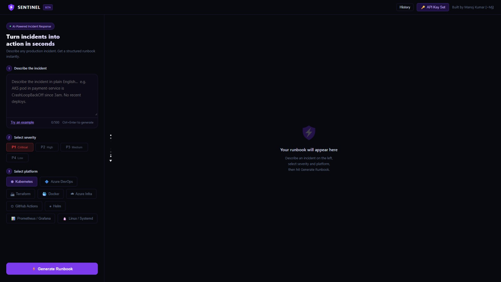

# SENTINEL — Incident Runbook Generator
> Turn incidents into action in seconds.

**Live:** [sentinel-ai-beta-smoky.vercel.app](https://sentinel-ai-beta-smoky.vercel.app)

&nbsp;



---

## What it does

Paste any incident description. SENTINEL generates a production-ready runbook — structured diagnosis steps, likely causes ranked by confidence, fix steps, escalation path, post-mortem template, and a decision tree.

No more blank-page paralysis during an outage. No more forgetting steps under pressure. No more writing the same post-mortem from scratch every time.

---

## Why I built this

Incident response is where engineering maturity shows. I've seen engineers freeze at 2AM not because they didn't know the fix — but because they had no structure to follow. The first 5 minutes of an incident define whether it gets resolved in 20 minutes or 4 hours.

SENTINEL gives you that structure instantly. It encodes SRE thinking — classification, diagnosis, blameless post-mortem, escalation — so you can focus on the fix, not the process.

---

## Platforms supported

| Platform | What it covers |
|---|---|
| **Kubernetes** | CrashLoopBackOff, OOMKilled, probe failures, PDB conflicts |
| **Terraform** | State lock, provider auth, plan/apply failures, remote backend issues |
| **Azure DevOps** | Pipeline failures, service connection errors, agent issues |
| **Prometheus / Grafana** | No Data alerts, relabeling issues, scrape failures |
| **Helm** | Pending-upgrade, hook timeouts, chart rendering errors |
| **General** | Any infrastructure or platform incident description |

---

## Output sections

Every runbook contains six structured sections:

| Section | Content |
|---|---|
| 🔍 **Diagnosis Steps** | 4–6 real CLI commands to run first |
| ⚠️ **Likely Causes** | 3–5 causes ranked by confidence |
| 🔧 **Fix Steps** | Step-by-step resolution actions |
| 📞 **Escalation Path** | T+Xm timeline — who to page and when |
| 📋 **Post-Mortem** | 7-field blameless template, ready to paste |
| 🌲 **Decision Tree** | Yes/No branching logic for diagnosis |

Every section has a copy button. Entire runbook exports as a `.md` file.

**Export filename format:**
```
sentinel-{severity}-{platform}-{date}.md
e.g. sentinel-p1-kubernetes-2026-09-17.md
```

---

## Severity classification

| Level | When |
|---|---|
| **P1 — Critical** | Active outage, data loss risk, drop everything |
| **P2 — High** | Production impact likely, fix now |
| **P3 — Medium** | Functional failure, fix before next deploy |
| **P4 — Low** | Warning or config drift, no immediate action |

---

## How it works

1. Enter your incident description in the left panel
2. Select severity and platform
3. Enter your free [Groq API key](https://console.groq.com/keys) — stored in your browser only, never on the server
4. Hit Generate — full runbook renders on the right in seconds
5. Copy individual sections or download the full runbook as Markdown

---

## Stack

- **Frontend + Backend** — Next.js 14 + TypeScript, deployed on Vercel
- **AI** — `openai/gpt-oss-120b` via Groq SDK, BYOK
- **Storage** — localStorage only (API key + last 5 runbooks, zero server storage)
- **Cost** — $0. You bring your own Groq key. Free tier covers all portfolio use.

---

## Key engineering decisions

- **Next.js App Router API route** — Single `POST /api/generate` handles everything. No separate backend, no cold starts, no Render free tier delays.
- **BYOK only** — Key lives in `localStorage`, sent per-request to the API route, never logged server-side. Server is stateless.
- **Strict JSON prompt** — System prompt enforces JSON-only output. `parser.ts` handles malformed responses with field-level fallbacks — app never crashes on bad AI output.
- **Animated flow divider** — 7-dot cascade animation between panels gives visual feedback without spinner noise.
- **History system** — Last 5 runbooks stored locally. Dedicated `/history` page — click any entry to restore the full runbook.

---

## Running locally

```bash
npm install
npm run dev
```

App runs at `http://localhost:3000`. No environment variables needed — API key comes from the user at runtime.

---

## Part of a DevOps tools portfolio

| Project | Description | Live |
|---|---|---|
| SENTINEL | Incident description → structured runbook | [Live](https://sentinel-ai-beta-smoky.vercel.app) |
| AI DevOps Incident Copilot | Paste failed log → root cause + fix | [Live](https://ai-dev-ops-incident-copilot.vercel.app) |
| Azure Pipeline YAML Generator | Plain English → azure-pipelines.yml | [Live](https://azure-pipeline-yaml-generator.vercel.app) |
| Kubernetes YAML Validator | Paste K8s YAML → errors + fixed version | [Live](https://kubernetes-yaml-validator.vercel.app) |
| DevOps Interview Copilot | Practice DevOps interview Q&A with AI | [Live](https://devops-interview-copilot.vercel.app) |

---

Built by [Manoj Kumar](https://linkedin.com/in/manoj2606) — Senior DevOps Engineer